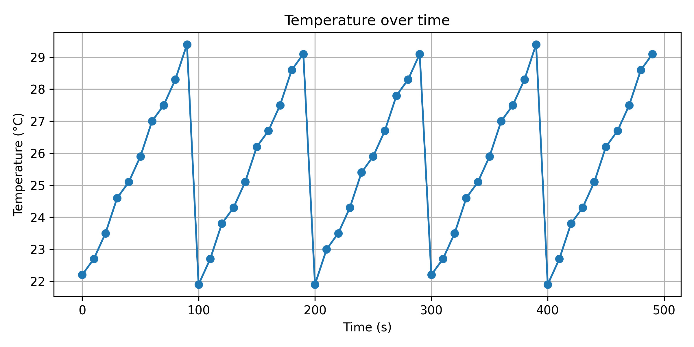
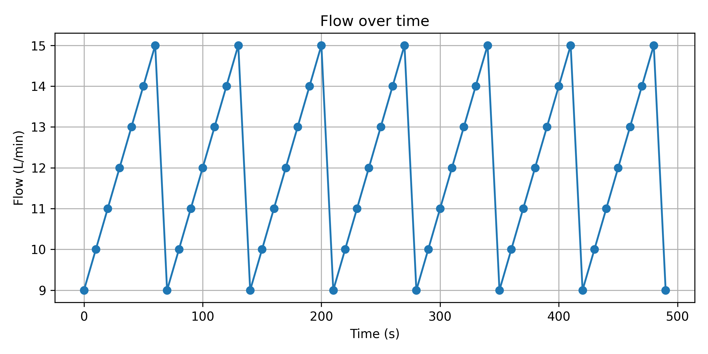
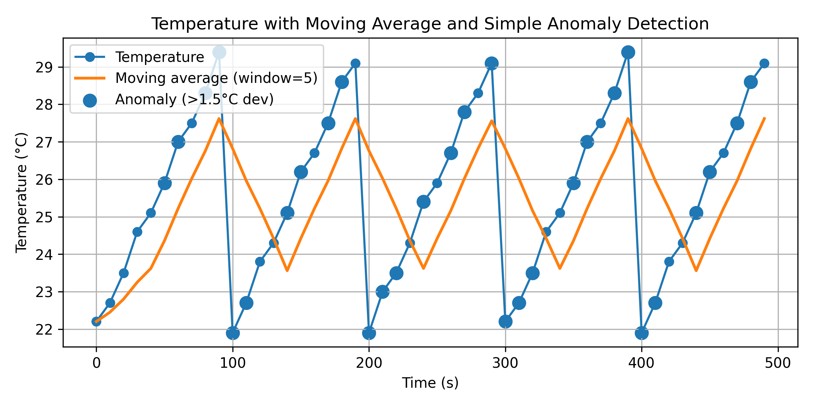

# Python Sensor Data Analysis Tool

This project demonstrates how Python can be used to analyze engineering sensor data exported from Excel.

The tool performs basic statistical analysis, generates visualizations, and detects potential anomalies in temperature measurements.

## Features

- Import sensor data from Excel
- Statistical analysis of measurement data
- Visualization of temperature, pressure, and flow trends
- Moving average analysis
- Simple anomaly detection

## Example Visualizations

### Temperature Trend

### Pressure Trend
.png)

### Flow Rate

### Temperature Anomaly Detection

## Technologies

- Python
- Pandas
- Matplotlib
- Excel
- Google Colab

## Potential Applications

- Industrial sensor monitoring
- Engineering test data analysis
- System diagnostics
- Operational performance analysis
